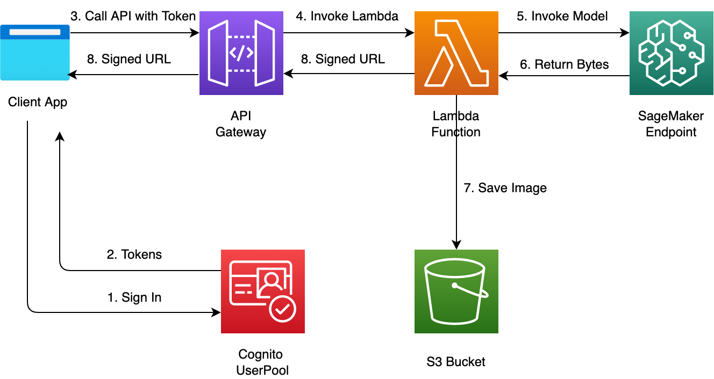

## Introduction



[GitHub](https://github.com/cdk-entest/next-stable-diffusion/tree/main) this note shows how to build a simple image generating app with nextjs and stable diffusion hosted on Amazon SageMaker.

## Lambda Function

- Deploy via ECR
- Configure provisioned concurrency

Due to heavy dependencies 303MB of sagemaker and stable difussion client, I have to deploy the Lambda function using ECR

```ts
const draw = new aws_lambda.Function(this, "DiffusionLambdaPublic", {
  functionName: "DiffusionLambdaPublic",
  code: aws_lambda.EcrImageCode.fromAssetImage(
    path.join(__dirname, "./../lambda-diffusion")
  ),
  handler: aws_lambda.Handler.FROM_IMAGE,
  runtime: aws_lambda.Runtime.FROM_IMAGE,
  memorySize: 1024,
  timeout: Duration.seconds(25),
  role: roleForLambda,
  environment: {
    BUCKET_NAME: props.bucketName,
    ENDPOINT_NAME: props.endpointName,
  },
});
```

The total latency of generating image by stable diffusion (25 seconds) and lambda cold start might be greater than 29 seconds. To hot fix for a demo, I configure Lambda provisioned concurrency

```ts
const alias = new aws_lambda.Alias(this, "LiveAliasConcurrencyProvisioned", {
  aliasName: "live",
  version: draw.currentVersion,
  provisionedConcurrentExecutions: 10,
});
```

Project structure for lambda ecr

```
|--bin
|--lib
|--lambda-diffusion
   |--Dockerfile
   |--.dockerignore
   |--requirements.txt
   |--index.py
   |--package
```

We need to install dependencies in target directory package

```bash
python -m pip install -r requirements.txt --target package
```

Content of the Dockerfile

```ts
FROM public.ecr.aws/lambda/python:3.9

# create code dir inside container
RUN mkdir ${LAMBDA_TASK_ROOT}/source

# copy code to container
COPY "requirements.txt" ${LAMBDA_TASK_ROOT}/source

# copy handler function to container
COPY ./index.py ${LAMBDA_TASK_ROOT}

# install dependencies for running time environment
COPY ./package/ ${LAMBDA_TASK_ROOT}

# set the CMD to your handler
CMD [ "index.handler" ]
```

## API Gateway

Let integrate the lambda alias with API Gateway. Please ensure that the API Gateway has permissions to invoke the lambda alias

```ts
const roleForApiGw = new aws_iam.Role(this, "RoleForApiGwInvokeDrawPublic", {
  roleName: "RoleForApiGwInvokeDrawPublic",
  assumedBy: new aws_iam.ServicePrincipal("apigateway.amazonaws.com"),
});

roleForApiGw.addToPolicy(
  new aws_iam.PolicyStatement({
    effect: aws_iam.Effect.ALLOW,
    actions: ["lambda:InvokeFunction"],
    resources: [draw.functionArn, `${draw.functionArn}:*`],
  })
);

roleForApiGw.addToPolicy(
  new aws_iam.PolicyStatement({
    effect: aws_iam.Effect.ALLOW,
    actions: [
      "logs:CreateLogGroup",
      "logs:CreateLogStream",
      "logs:DescribeLogGroups",
      "logs:DescribeLogStreams",
      "logs:PutLogEvents",
      "logs:GetLogEvents",
      "logs:FilterLogEvents",
    ],
    resources: ["*"],
  })
);
```

Enable CORS and logging

```ts
const apigw = new aws_apigateway.RestApi(this, "ApiForDiffusionModelPublic", {
  restApiName: "ApiForDiffusionModelPublic",
  deploy: false,
  cloudWatchRole: true,
});

const image = apigw.root.addResource("image");

const getImageMethod = image.addMethod(
  "GET",
  new aws_apigateway.LambdaIntegration(alias, {
    credentialsRole: roleForApiGw,
  })
);

image.addCorsPreflight({
  allowOrigins: ["*"],
  allowMethods: ["GET", "POST", "OPTIONS"],
  allowHeaders: ["*"],
});

const logGroup = new aws_logs.LogGroup(this, "AccessLogForDiffusionPublic", {
  logGroupName: "AccessLogForDiffusionPublic",
  removalPolicy: RemovalPolicy.DESTROY,
  retention: RetentionDays.ONE_WEEK,
});
```

Create deployment stage

```ts
const deployment = new aws_apigateway.Deployment(
  this,
  "DeployDiffusionApiPublic",
  {
    api: apigw,
  }
);

const prodStage = new aws_apigateway.Stage(this, "DiffusionProdStagePublic", {
  stageName: "prod",
  deployment,
  dataTraceEnabled: true,
  accessLogDestination: new aws_apigateway.LogGroupLogDestination(logGroup),
  accessLogFormat: aws_apigateway.AccessLogFormat.jsonWithStandardFields(),
});
```

Finally, consider API Key and usage plan

```ts
new aws_apigateway.RateLimitedApiKey(this, "RateLimitForDiffusionPublic", {
  apiKeyName: "RateLimitForDiffusionPublic",
  customerId: "DiffusionPublic",
  apiStages: [
    {
      api: apigw,
      stage: prodStage,
      throttle: [
        {
          method: getImageMethod,
          throttle: {
            burstLimit: 20,
            rateLimit: 10,
          },
        },
      ],
    },
  ],
  quota: {
    limit: 300,
    period: aws_apigateway.Period.DAY,
  },
  throttle: {
    burstLimit: 20,
    rateLimit: 10,
  },
  enabled: true,
  generateDistinctId: true,
  description: "rate limit for customer a by api key",
});
```

## Front End

Just create a simple form, submit and call an API to get the generated image

<details>
<summary>FrontEnd</summary>

```ts
"use client";

import axios from "axios";
import { useEffect, useState } from "react";
import { config } from "@/config";

const HomePage = () => {
  const [url, setUrl] = useState<string | null>(null);
  const [modal, setModal] = useState<Boolean>(false);
  const [counter, setCounter] = useState<Number>(25);

  const generateImage = async (prompt: string) => {
    // const token = localStorage.getItem("IdToken");

    try {
      const { data, status } = await axios.get(config.API_DIFFUSION, {
        // headers: {
        //   Authorization: `Bearer ${token}`,
        //   "Content-Type": "application/json",
        // },
        params: {
          prompt: prompt,
        },
      });

      console.log(data);

      setUrl(data.url);
    } catch (error) {
      console.log(error);
    }

    setModal(false);
  };

  const timer = () => {
    var timeleft = 25;
    var downloadTimer = setInterval(function () {
      if (timeleft <= 0) {
        clearInterval(downloadTimer);
      } else {
      }

      setCounter(timeleft);

      timeleft -= 1;
    }, 1000);
  };

  useEffect(() => {}, [url, modal]);

  useEffect(() => {}, [counter]);

  return (
    <div className="min-h-screen dark:bg-slate-800">
      <div className="mx-auto max-w-3xl dark:bg-slate-800 dark:text-white px-10">
        <div className="mb-5">
          <textarea
            id="prompt"
            name="prompt"
            rows={2}
            placeholder="describe an image you want..."
            className="p-2.5 w-full text-gray-900 bg-slate-200  rounded-lg border border-gray-300 focus:border-2 focus:ring-blue-500 focus:border-blue-500 dark:bg-gray-700 dark:border-gray-600 dark:placeholder-gray-400 dark:text-white dark:focus:ring-blue-500 dark:focus:border-blue-500 my-5 outline-none focus:outline-none"
          ></textarea>
          <button
            className="bg-orange-400 px-10 py-3 rounded-sm"
            onClick={async () => {
              let prompt = (
                document.getElementById("prompt") as HTMLInputElement
              ).value;

              if (prompt === "") {
                prompt = "a big house";
              }

              setUrl(null);
              setCounter(25);
              setModal(true);
              timer();
              await generateImage(prompt);
            }}
          >
            Submit
          </button>
        </div>
        {url ? (
          <div>
            </img>
          </div>
        ) : (
          ""
        )}

        {modal === true ? (
          <div
            className="fixed top-0 bottom-0 left-0 right-0 bg-slate-500 bg-opacity-70"
            id="modal"
          >
            <div className="mx-auto max-w-3xl sm:p-10 p-5">
              <div className="justify-center items-center flex bg-white py-20 px-10 rounded-lg relative">
                <h1 className="text-black" id="countdown">
                  Please wait {String(counter)} for generating your image
                </h1>
              </div>
            </div>
          </div>
        ) : (
          ""
        )}
      </div>
    </div>
  );
};
export default HomePage;
```

</details>

## Amplify Hosting

> [!IMPORTANT]  
> Please setup TOKEN on your GitHub account setting and then store the TOKEN in Amazon Secret Manager

Let create a stack to deploy the app on Amplify

```ts
import { SecretValue, Stack, StackProps, aws_codebuild } from "aws-cdk-lib";
import { Construct } from "constructs";
import * as Amplify from "@aws-cdk/aws-amplify-alpha";

interface AmplifyHostingProps extends StackProps {
  owner: string;
  repository: string;
  token: string;
  envVariables: any;
  commands: any;
}

export class AmplifyHosting extends Stack {
  constructor(scope: Construct, id: string, props: AmplifyHostingProps) {
    super(scope, id, props);

    const amplify = new Amplify.App(this, "NextStableDiffusionDemo", {
      sourceCodeProvider: new Amplify.GitHubSourceCodeProvider({
        owner: props.owner,
        repository: props.repository,
        oauthToken: SecretValue.secretsManager(props.token),
        // oauthToken: SecretValue.unsafePlainText(props.token),
      }),
      buildSpec: aws_codebuild.BuildSpec.fromObjectToYaml({
        version: "1.0",
        frontend: {
          phases: {
            preBuild: {
              commands: ["npm ci"],
            },
            build: {
              commands: props.commands,
            },
          },
          artifacts: {
            baseDirectory: ".next",
            files: ["**/*"],
          },
          cache: {
            path: ["node_modules/**/*"],
          },
        },
      }),
      platform: Amplify.Platform.WEB_COMPUTE,
      environmentVariables: props.envVariables,
    });

    amplify.addBranch("main", { stage: "PRODUCTION" });
  }
}
```

## Reference

- [Understanding AWS Lambda’s invoke throttling limits](https://aws.amazon.com/blogs/compute/understanding-aws-lambdas-invoke-throttle-limits/)

- [AWS API Gateway throttling explained](https://xebia.com/blog/aws-api-gateway-throttling-explained/)

- [Regulating inbound request rates – part 1](https://aws.amazon.com/blogs/compute/building-well-architected-serverless-applications-regulating-inbound-request-rates-part-1/)

- [Controlling serverless API access – part 2](https://aws.amazon.com/blogs/compute/building-well-architected-serverless-applications-controlling-serverless-api-access-part-2/)

- [Controlling serverless API access – part 3](https://aws.amazon.com/blogs/compute/building-well-architected-serverless-applications-controlling-serverless-api-access-part-3/)
